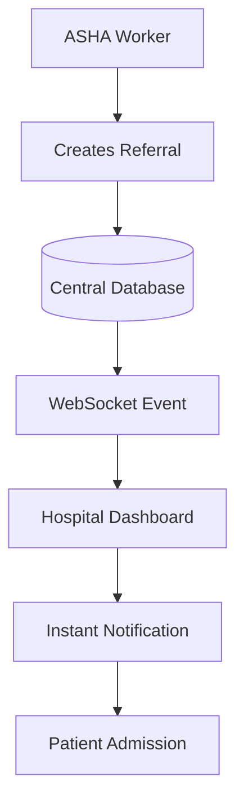

# AshaBridge

> **Connecting Villages to Lifesaving Care**

AshaBridge is an AI-powered rural healthcare referral platform that bridges the gap between **ASHA workers, Primary Health Centres (PHCs), and urban hospitals**. The system enables community health workers to register patients, assess basic vitals, generate intelligent referrals, and securely share medical records with hospitals in real time.

The platform creates a continuous digital healthcare workflow—from village registration to specialist treatment—reducing delays, unnecessary travel, and information loss.

---

## The Problem

Millions of rural patients face delayed access to specialist healthcare because of:

- Limited availability of doctors in villages
- Manual paper-based referral systems
- Lack of real-time hospital bed information
- Fragmented patient medical records
- Long travel distances without knowing hospital capacity

AshaBridge digitizes this entire process through an integrated referral ecosystem.

---

## Solution Overview

AshaBridge provides a connected platform for every stakeholder involved in rural healthcare.

| Stakeholder | Purpose |
|------------|---------|
| **ASHA Worker** | Register patients, record vitals, create referrals |
| **PHC Doctor** | Review patient details and approve referrals |
| **Hospital** | Accept referrals and assign specialists |
| **Specialist** | Validate diagnosis and prescribe treatment |
| **Admin** | Monitor hospitals, beds, referrals, and analytics |

---

## Key Features

### ASHA Worker Portal

- Patient registration
- Digital health profile creation
- Record symptoms & vitals
- SpO₂, BP, temperature, pulse entry
- AI-assisted referral generation
- Referral status tracking

### Hospital Dashboard

- Live incoming referral notifications
- Bed availability management
- Specialist availability
- Patient admission workflow
- Treatment history access
- Real-time dashboard analytics

### AI Referral Engine

- Matches patient with suitable hospital
- Considers bed availability
- Checks specialist availability
- Prioritizes emergency cases
- Generates unique digital referral IDs

### Digital Health Records

- Centralized patient history
- Secure record sharing
- Visit timeline
- Prescription storage
- Continuous treatment tracking

---

## System Architecture

```text
                        ASHABRIDGE ECOSYSTEM

 +--------------------+        +----------------------+
 |   ASHA WORKER APP  |------->|   AI REFERRAL CORE  |
 |--------------------|        |----------------------|
 | Register Patient   |        | Bed Availability     |
 | Capture Vitals     |        | Specialist Matching  |
 | Symptoms           |        | Referral Decision    |
 +--------------------+        +----------+-----------+
                                          |
                                          |
                              Digital Referral Ticket
                                          |
              ------------------------------------------------
              |                                              |
              v                                              v
 +-----------------------+                     +------------------------+
 | PRIMARY HEALTH CENTRE |                     |   URBAN HOSPITAL       |
 |-----------------------|                     |------------------------|
 | Review Patient        |                     | Accept Referral        |
 | Verify Condition      |                     | Assign Specialist      |
 | Approve Referral      |                     | Admit Patient          |
 +-----------------------+                     +-----------+------------+
                                                          |
                                                          v
                                             +-------------------------+
                                             |  SPECIALIST & PHARMACY |
                                             |-------------------------|
                                             | Diagnosis               |
                                             | Prescription            |
                                             | Medication Delivery     |
                                             +-------------------------+

                     All data synchronized to Central Patient Record
```

---

## Complete Workflow


---

## ASHA Worker Workflow

The ASHA worker is the first point of contact in the healthcare journey.

### Step-by-step process

1. Register a new patient.
2. Enter demographic details.
3. Record symptoms.
4. Measure vitals:
   - SpO₂
   - Blood Pressure
   - Pulse Rate
   - Temperature
5. Submit assessment.
6. AI generates referral recommendation.
7. Patient receives referral ticket.

### Captured Patient Data

- Name
- Age & Gender
- Village
- Phone Number
- Symptoms
- Medical History
- SpO₂
- Blood Pressure
- Pulse
- Temperature

---

## Hospital Dashboard Workflow

The hospital dashboard provides real-time operational visibility.

### Hospital staff can:

- View incoming referrals
- Check patient priority
- Verify medical records
- Allocate available beds
- Assign specialists
- Update treatment progress
- Discharge patient
- Close referral case

### Live Dashboard Modules

- Total Patients
- Available Beds
- Specialists On Duty
- Pending Referrals
- Emergency Cases
- Completed Treatments

---

## Referral Logic

The referral engine selects the most appropriate hospital using healthcare resource availability rather than manual selection.

### Decision factors

- Patient severity
- Required specialty
- Bed availability
- Specialist availability
- Referral priority

### Referral Categories

| Category | Priority |
|----------|----------|
| Critical | Immediate |
| High | Urgent |
| Moderate | Standard |
| Low | Routine |

---

## Database Design

```text
Patients
   │
   ├── Personal Information
   ├── Medical History
   └── Vitals

Referrals
   │
   ├── Referral ID
   ├── Source PHC
   ├── Destination Hospital
   ├── Status
   └── Priority

Hospitals
   │
   ├── Bed Capacity
   ├── Available Beds
   └── Specialists

Treatment Records
   │
   ├── Diagnosis
   ├── Prescription
   └── Follow-up
```

---

## Technology Stack

| Layer | Technology |
|--------|------------|
| Backend | Flask |
| Frontend | HTML, CSS, JavaScript |
| Database | SQLite |
| Real-time Updates | WebSockets |
| AI Logic | Python |
| ORM | SQLAlchemy |

---


This ensures hospitals receive referrals immediately without manual communication.

---

## Security & Reliability

- Unique digital referral IDs
- Centralized patient records
- Hospital-side validation before admission
- Real-time synchronization
- Structured relational database
- Reduced duplicate referrals

---

## Impact

- Faster specialist access for rural patients
- Reduced unnecessary travel to full hospitals
- Real-time coordination between villages and hospitals
- Continuous digital patient care journey
- Better utilization of beds and specialists
- Reduced paperwork through digital referrals

---

## Future Enhancements

- Multilingual voice support for ASHA workers
- Offline-first mobile application
- SMS referral notifications
- Electronic prescription download
- Government health scheme integration

---

## Project Credits

**AshaBridge** is a healthcare innovation platform developed to digitally connect rural communities with urban hospitals through intelligent referrals, real-time hospital coordination, and centralized patient health records.

---

## Vision

**Making quality healthcare accessible—one referral, one village, one life at a time.**
